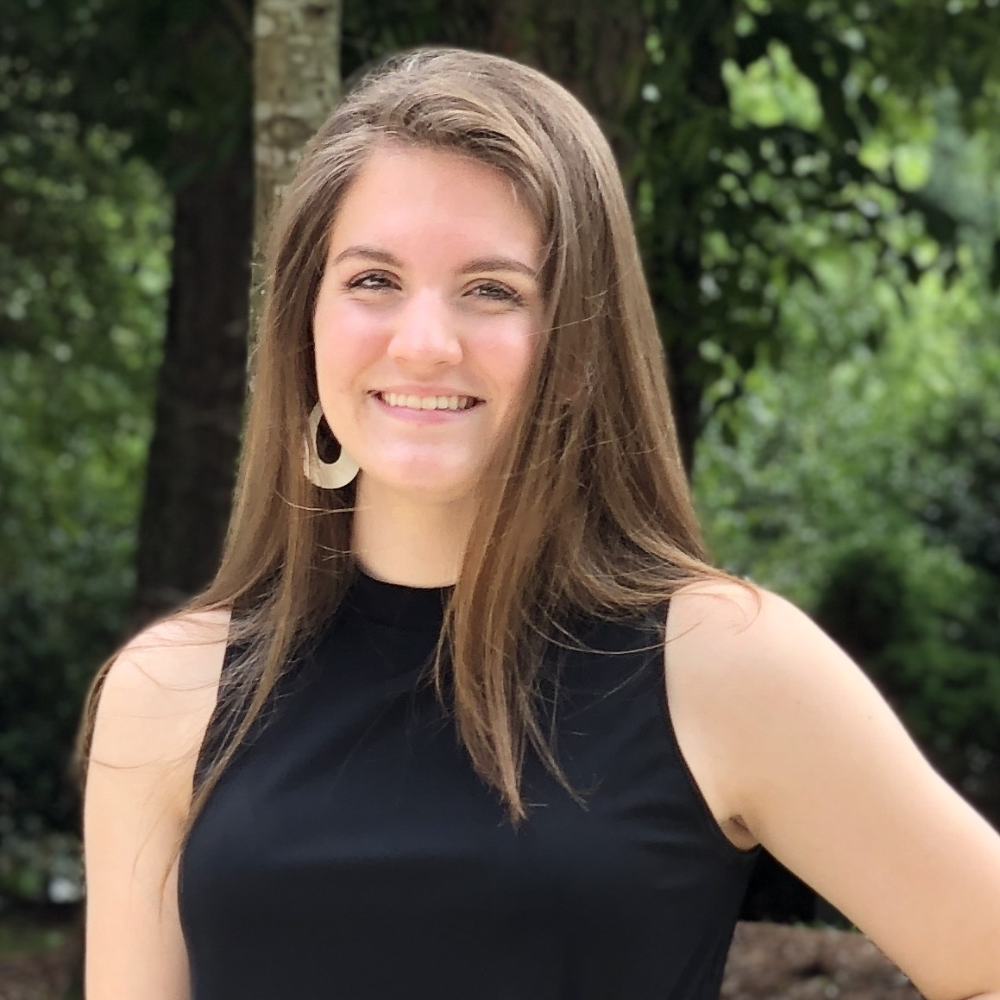

M.R. Darwin
======

##### darwinmr@appstate.edu 
#### Summary
[Department of Geography and Planning](https://geo.appstate.edu/)
Reliable and communicative undergraduate student looking to gain applied experience in Planning and GIS. Specific interests include municipality operations, transportation and traffic, and environmental consequences of community development and maintenance. Eager to find opportunities where technical and professional skills can be developed. 

______
## Education
#### Appalachian State University
Geography GIS Concentration B.S.
Community and Regional Planning B.S. 

## Work Experience
###### AppalCART 
- Apprentice        Jun 2023 - Present
    - even more work and stuff 

###### APPALACHIAN DINING SERVICES	Boone, NC
- Barista     		Aug 2022 – May 2023
    - Demonstrate effective time management and flexibility working at multiple locations across campus 
    - Practice customer service and communication when completing drink and breakfast orders

###### USA BASEBALL	Cary, NC
- Supervisor of Retail Operations	Jun 2017 – Aug 2022
    - Held summer job for 5 years, retail and customer service experience through ticket sales and merchandise sales
    - Trained employees on store operations, and maintained a healthy work environment
    - Managed storefront and stockroom 

###### UNC STUDENT STORES 	Chapel Hill, NC
- Pit Stop (Convenience Food) Supervisor	Aug 2021-May 2022
    - Led other employees in retail tasks such as register operations, restocking, and auditing
    - Maintained storefronts on multiple floors 
    - Experience with auditing and updating system logs

## University Projects/Activities
- ###### APPALACHIAN STATE GEOGRAPHY & PLANNING CLUB	Boone, NC
    - Vice President, Social Media Manager	Aug 2022 - Present
    - Reinstated club after post-COVID hiatus 
    - Created presentations, organized activities, and led communication between faculty and other officers
    - Advertised club activities through social media and printed materials  

- ###### CAROLINA COMMUNITY GARDEN	Chapel Hill, NC
    - Compost Manager	Jan 2021 – Jan 2022
        - Developed materials to educate volunteers on the composting process
        - Led composting activities for 2 hours weekly, including vermicompost and traditional compost

----
